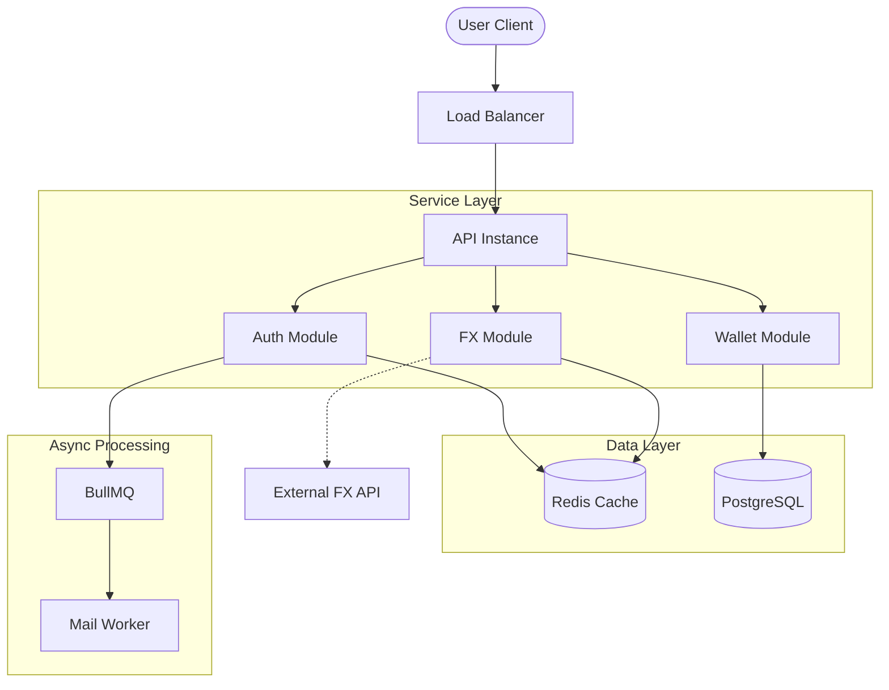
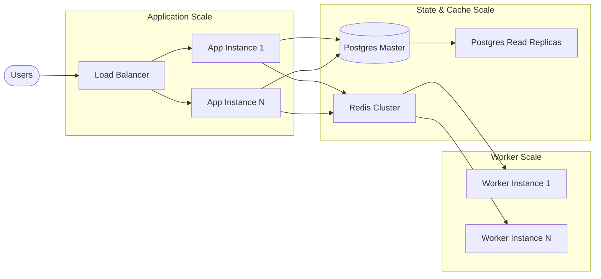

# FX Exchange API

A high-performance currency exchange and wallet management service built with NestJS. This application provides a production-ready solution for managing multi-currency balances, real-time rate discovery, and atomic financial conversions.

## System Architecture

The application follows a modular monolith approach, ensuring a clean separation of concerns between authentication, wallet operations, and foreign exchange logic.

### Technical Stack
* **Framework**: NestJS (Node.js)
* **Database**: PostgreSQL with TypeORM
* **Caching**: Redis
* **Task Queue**: BullMQ
* **Security**: JWT Authentication and OTP Verification

### Component Interaction Flow



---

## Core Functionality

### Authentication and Onboarding
Registration is secured via an email-based One-Time Password (OTP) system. Upon successful verification, users are issued a JWT for session management. This ensures that only verified users can access financial endpoints.

### Wallet and Balance Management
The system utilizes a wallet-per-user model, where a single wallet contains multiple distinct balances isolated by currency (e.g., USD, EUR, NGN). All balance updates are performed using pessimistic row-level locking to ensure total consistency during concurrent operations.

### Atomic Currency Conversion
The FX engine performs conversions as atomic transactions. When a user swaps currencies, the system debits the source balance and credits the target balance within a single database transaction. This prevents "partial success" scenarios and ensures the total value of assets remains consistent.

---

## Production Guarantees

### Financial Integrity
* **Optimized Isolation**: The system uses the **READ COMMITTED** isolation level combined with explicit row-level locking (**FOR UPDATE**) to provide the best balance between performance and consistency.
* **Pessimistic Locking**: Row-level locks are acquired on balances during updates to prevent race conditions and ensure data integrity in high-concurrency environments.
* **Idempotency**: All write operations (funding, conversion) require a client-provided idempotency key, preventing duplicate processing of the same transaction.

### Resilience and Safety
* **FX Rate Fallback**: Real-time rates are cached in Redis. In the event of an external provider failure, the system automatically falls back to the last known good rates to maintain service availability.
* **Auditability**: Every balance change is recorded in an immutable transaction log, providing a complete audit trail for reconciliation.

---

## Scaling Strategy

The application is designed to scale horizontally across every layer of the stack.

### Scaling Architecture



### Strategic Path to Scale
* **Stateless API**: Application instances carry no local state, allowing them to be scaled up or down behind a load balancer without impact.
* **Database Optimization**: The system is ready for read-replicas to offload heavy query traffic (like transaction history) from the master node.
* **Distributed Queues**: Using BullMQ with Redis enables horizontal scaling of background workers to handle massive volumes of asynchronous tasks.
* **Connection Management**: Active pooling ensures efficient use of database resources as the number of application instances increases.

---

## Getting Started

### Prerequisites
* Node.js (v18+)
* Docker and Docker Compose

### Quick Start
The easiest way to start the development environment is using the provided script:

```bash
./scripts/dev.sh
```

### API Documentation
Once the service is running, interactive Swagger documentation is available at:
[http://localhost:3000/api/docs](http://localhost:3000/api/docs)

---

## Testing
The codebase maintains high stability through rigorous unit and integration testing:
```bash
npm run test        # Unit tests
npm run test:e2e    # E2E test suite
```
