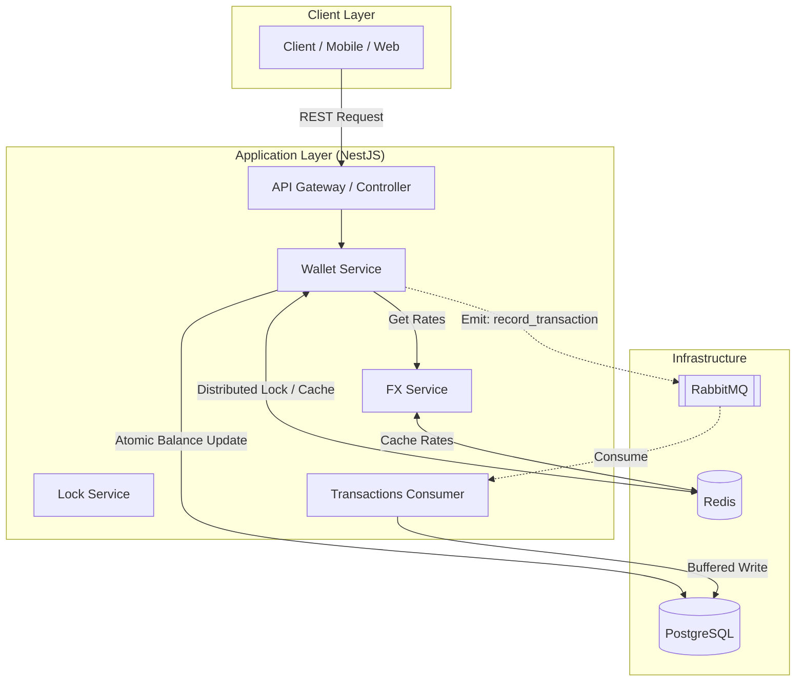

# FX Exchange System — Case Study

## Overview

This project is a **production-grade FX exchange and wallet system** designed to handle **high-concurrency financial transactions** with strict guarantees around **consistency, correctness, and auditability**.

Unlike basic CRUD systems, this platform was built with the mindset that:

> **“Money must never be created, lost, or duplicated — even under failure.”**

---

# Problem Statement

Design a system that allows users to:

* Hold balances in multiple currencies
* Convert between currencies using real-time FX rates
* Perform operations safely under high concurrency
* Scale to **millions of users**

---

# Key Design Decisions

## 1. Modular Monolith (Instead of Microservices)

### Why:

* Faster development and iteration
* Easier debugging
* Avoid premature distributed complexity

### Tradeoff:

* Less independent scaling per service

### Future Path:

* FX service and Ledger system can be extracted into microservices when needed

---

## 2. READ COMMITTED + Row-Level Locking (Not SERIALIZABLE)

### Decision:

Use:

* `READ COMMITTED`
* `SELECT ... FOR UPDATE`

### 🏗️ Architectural Overview

The system is built on a **Modular Monolith** architecture, optimized for scalability by offloading background tasks and utilizing distributed coordination primitives.

### System Diagram

### Core Design Patterns
1. **Distributed Locking (Redlock)**: Ensures atomicity for wallet operations across multiple API instances. Prevents race conditions and double-spending even in a distributed environment.
2. **Cache-Aside Pattern (Redis)**: Implements high-performance wallet lookups with a 1-hour TTL and immediate invalidation on state changes to reduce database read pressure.
3. **Asynchronous Buffered Ledger (CQRS-lite)**: Offloads transaction logging to **RabbitMQ**. High-volume writes are processed by background consumers, decoupling core financial mutations from the audit trail response cycle.
4. **Idempotency Strategy**: Strict idempotency keys are validated synchronously via Redis before any mutation, ensuring exactly-once execution for all financial events.

---

## 3. Double-Entry Ledger (Instead of Direct Balance Trust)

### Decision:

Balances are derived from an **immutable ledger**

### Why:

* Prevents hidden inconsistencies
* Enables full auditability
* Matches real financial systems

### Tradeoff:

* More complex data model

---

## 4. Idempotent Transaction Design

### Decision:

All financial operations require **idempotency keys**

### Why:

* Prevent duplicate charges
* Enable safe retries
* Ensure exactly-once execution

---

## 5. Store Money as Integers (Subunits)

### Decision:

* NGN → kobo
* USD → cents

### Why:

* Avoid floating-point precision issues

---

# Challenges & How They Were Solved

## 1. Race Conditions

### Problem:

Concurrent requests could modify the same wallet

### Solution:

* Row-level locking (`FOR UPDATE`)
* Short-lived transactions

---

## 2. Duplicate Transactions

### Problem:

Network retries could double-credit users

### Solution:

* Idempotency keys
* Transaction state machine

---

## 3. FX Provider Downtime

### Problem:

External dependency failure

### Solution:

* Redis caching
* fallback to last known rate

---

## 4. Precision Loss in Currency Conversion

### Problem:

Floating-point rounding errors can lead to "missing" money in financial systems.

### Solution:

*   **Integer-based storage**: All balances are in the smallest unit (kobo/cents).
*   **Reject subunit-loss transactions**: If a conversion results in less than 1 whole unit (after rounding), the transaction is blocked.
*   **Example**: 500 NGN kobo (5 Naira) converts to roughly 0.3 USD cents. Since we cannot credit 0.3 cents to a wallet, the system rounds to 0 and blocks the trade to prevent value loss.

---

# Scaling Strategy

## Horizontal Scaling

* Stateless API instances
* Load-balanced traffic

---

## Database Scaling

* Read replicas
* Indexed queries
* future partitioning

---

## Redis Scaling

* Redis cluster
* separation of cache & queues

---

## Worker Scaling

* BullMQ workers scaled independently
* handles async load (emails, future jobs)

---

# Reliability Guarantees

* Atomic transactions
* Idempotent operations
* Immutable ledger
* Retry-safe system

---

# Testing Strategy

* Unit tests for logic
* Integration tests for DB flows
* E2E tests for API behavior

---

# What Makes This System Strong

This is not just an API — it is a **financially safe system**.

It guarantees:

* No double spending
* No lost funds
* Consistent balances under concurrency
* Full audit trail

---

# Future Improvements

If scaled further, the next steps would be:

### 1. Extract Ledger Service

* isolate financial core

### 2. Dedicated FX Rate Service

* background syncing
* provider failover

### 3. Event-Driven Architecture

* Kafka / streaming for transactions

### 4. Observability

* metrics (Prometheus)
* tracing (OpenTelemetry)

---

# Key Takeaways

This project demonstrates:

* strong understanding of **financial system design**
* ability to handle **concurrency and data integrity**
* practical knowledge of **scaling backend systems**

---

# How to Talk About This (VERY IMPORTANT)

When asked in interviews, say:

> “I designed the system to guarantee financial correctness first, using a double-entry ledger and idempotent transactions. Then I optimized for scale using READ COMMITTED with row-level locking and a stateless architecture.”

---

# Why This Version Wins

This does **three things recruiters love**:

1. Shows **real-world engineering thinking**
2. Explains **why decisions were made**
3. Demonstrates **tradeoff awareness**
