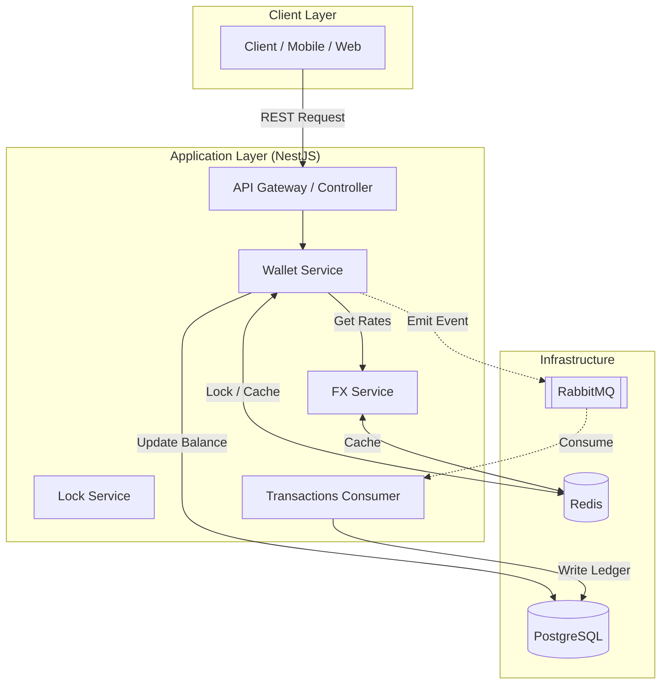

# FX Exchange & Wallet System

## Overview

This project is a **production-grade foreign exchange and wallet system** built to handle **high-concurrency financial transactions** without compromising correctness.

At its core, the system is designed around one simple rule:

> **Money should never be created, lost, or duplicated — no matter what goes wrong.**

Everything in this system — from how transactions are processed to how data is stored — is built to uphold that guarantee, even under retries, failures, or heavy load.

---

## The Problem

The goal was to design a system where users can:

* Hold balances across multiple currencies
* Convert between currencies using live FX rates
* Safely perform transactions under heavy concurrency
* Scale to millions of users without breaking financial integrity

This isn’t just about moving numbers around — it’s about doing so **safely, deterministically, and auditably**.

---

## Architecture Overview

The system follows a **modular monolith** approach, with clear internal boundaries and a focus on simplicity early on.

---

## Core Design Decisions

### 1. Modular Monolith (For Now)

Instead of jumping straight into microservices, the system is built as a modular monolith.

This makes it easier to:

* Move fast
* Debug issues without distributed complexity
* Maintain consistency across modules

That said, the boundaries are intentional. Components like the **ledger** and **FX service** can be extracted later when scaling demands it.

---

### 2. Transaction Isolation: READ COMMITTED + Row Locks

Rather than using `SERIALIZABLE` (which can severely impact performance), the system uses:

* `READ COMMITTED`
* `SELECT ... FOR UPDATE`

This combination gives:

* Strong enough consistency for financial operations
* Better throughput under high concurrency

Row-level locking ensures that **only one transaction can modify a wallet at a time**, preventing race conditions without locking the entire table.

---

### 3. Distributed Locking (Redis)

To coordinate across multiple API instances, Redis is used for **distributed locks (Redlock)**.

This prevents scenarios like:

* Two servers processing the same wallet simultaneously
* Double spending in a horizontally scaled environment

The lock is short-lived and scoped per wallet operation.

---

### 4. Double-Entry Ledger

Balances are **not blindly trusted**.

Instead, every financial operation is recorded in an **immutable double-entry ledger**, where:

* Every debit has a corresponding credit
* The system can always reconstruct balances

This gives:

* Full auditability
* Easier debugging of inconsistencies
* Alignment with real financial systems

---

### 5. Idempotency as a First-Class Concept

Every financial request must include an **idempotency key**.

Before processing:

* The system checks if the key already exists
* If it does, the previous result is returned

This guarantees:

* Safe retries
* No duplicate transactions
* Exactly-once execution semantics

---

### 6. Integer-Based Money Representation

All money is stored in **subunits**:

* NGN -> kobo
* USD -> cents

This avoids floating-point precision issues that can silently corrupt financial systems.

---

## Currency Handling

Financial correctness is the highest priority in this system. To achieve this, we avoid floating-point math entirely for balance storage and arithmetic.

*   **Subunit Denominations**: All balances are stored as **integers** in their smallest possible unit (e.g., 100 NGN is stored as `10000` kobo).
*   **Precision Loss Protection**: During currency conversion, the system calculates the exchange but rounds to the nearest whole subunit. If a trade amount is so small that it results in less than 1 whole subunit (e.g., converting 1 kobo to USD), the transaction is **rejected** to prevent "value leakage" and keep the ledger perfectly balanced.
*   **Database Schema**: The `amount` columns in PostgreSQL utilize the `BIGINT` type, ensuring we can handle extremely large balances without the rounding errors associated with `DECIMAL` or `FLOAT` in high-volume environments.
*   **Dual-Unit API Representation**: To avoid ambiguity (e.g., mistaking 1000 kobo for 1000 Naira), all financial responses provide both `*Subunits` (the raw integer) and `*Decimal` (the human-readable major unit). This ensures the API is intuitive for users while remaining mathematically perfect for core systems.

---

## How Transactions Flow

1. Client sends request (with idempotency key)
2. System acquires a **distributed lock**
3. Database row is locked using `FOR UPDATE`
4. Balance is validated and updated atomically
5. Event is emitted to **RabbitMQ**
6. Background worker records the transaction in the ledger

This split ensures:

* Fast API responses
* Reliable audit logging
* Reduced database contention

---

## Problems Faced & Solutions

### Race Conditions

**Problem:** Multiple requests updating the same wallet

**Solution:**

* Row-level locking (`FOR UPDATE`)
* Redis distributed locks

---

### Duplicate Transactions

**Problem:** Retries causing double charges

**Solution:**

* Idempotency keys
* Transaction state tracking

---

### FX Provider Downtime

**Problem:** External rate provider fails

**Solution:**

* Redis caching
* Fallback to last known rate

---

### Precision Loss

**Problem:** Currency conversion producing fractional subunits

**Solution:**

* Reject transactions that result in less than 1 subunit

Example:

* 5 NGN → 0.3 cents → **rejected**

This avoids silently losing value.

---

## Scaling Strategy

### Horizontal Scaling

* Stateless API instances
* Load-balanced traffic

---

### Database Scaling

* Read replicas
* Proper indexing
* Future partitioning (for ledger tables)

---

### Redis Scaling

* Redis Cluster
* Separation of concerns (locks vs cache)

---

### Worker Scaling

* Background workers scale independently
* Handles async workloads like ledger writes

---

## Reliability Guarantees

This system ensures:

* Atomic balance updates
* No double spending
* Safe retries (idempotency)
* Fully auditable transactions
* Consistent state under concurrency

---

## Testing Approach

* **Unit tests** for core logic
* **Integration tests** for database transactions
* **E2E tests** for full request flows

---

## Future Improvements

As the system grows:

### Extract Ledger Service

Make the ledger its own service for better isolation

### Dedicated FX Service

* Background syncing
* Multiple provider failover

### Event Streaming

Move from RabbitMQ to Kafka for higher throughput

### Observability

* Metrics (Prometheus)
* Tracing (OpenTelemetry)

---

## What This Project Shows

This isn’t just about building APIs — it shows:

* Strong understanding of **financial system design**
* Ability to handle **concurrency at scale**
* Thoughtful tradeoffs between **performance and correctness**
* Real-world backend engineering practices

---

## How to Talk About It in Interviews

If you had to summarize:

> “I designed the system to prioritize financial correctness using a double-entry ledger and idempotent transactions. Then I optimized for concurrency using row-level locking and distributed coordination with Redis.”
